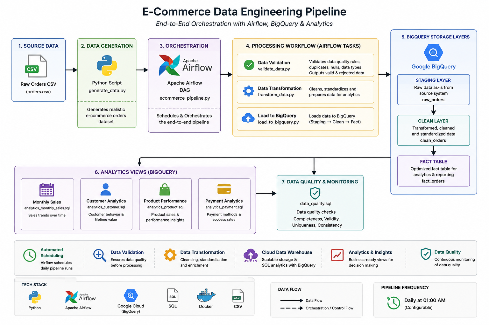

# E-Commerce Data Engineering Pipeline

An end-to-end data engineering pipeline built using Apache Airflow, Docker, PostgreSQL, and Google BigQuery.

The pipeline ingests e-commerce order data, performs data validation and transformation through multiple layers, loads the processed data into BigQuery, and creates analytics views for business reporting.

## Architecture



                 E-Commerce Source Data
                         │
                         ▼
                Python Data Generation
                         │
                         ▼
                    Apache Airflow
                         │
             ┌───────────┴───────────┐
             ▼                       ▼
       Data Validation         Data Transformation
             │                       │
             └───────────┬───────────┘
                         ▼
                    BigQuery
                         │
          ┌──────────────┼──────────────┐
          ▼              ▼              ▼
      STAGING          CLEAN           FACT
          │              │              │
          └──────────────┼──────────────┘
                         ▼
                Analytics Views
          ┌────────┬────────┬────────┐
          ▼        ▼        ▼        ▼
       Monthly  Customer  Product  Payment
                         │
                         ▼
                  Data Quality

## Project Highlights

- Built an end-to-end e-commerce data engineering pipeline using Python, Apache Airflow, Docker, PostgreSQL, and Google BigQuery.
- Designed a layered data architecture with Staging, Clean, and Analytics layers.
- Processed **116,221 orders** with **116,221 unique orders**.
- Processed **29,377 unique customers** and **2,000 unique products**.
- Generated **349,278 total units** and **164,660,809.80 total net sales**.
- Implemented automated data-quality validation for customer, product, quantity, pricing, payment, country, and order-status data.
- Implemented cross-layer reconciliation between Staging, Clean, Fact, and Analytics views.
- Created dedicated BigQuery analytics views for **monthly sales, customer, product, payment, and order-status analysis**.
- Built an **11-task Apache Airflow DAG** configured for **daily execution (`@daily`)**.
- Containerized the complete local orchestration environment using Docker Compose.
- Integrated Google Cloud BigQuery as the cloud data warehouse.
- Validated the final pipeline with all **11 Airflow tasks completing successfully**.

## Data Quality & Validation

The pipeline includes automated data-quality checks across the ingestion, transformation, and analytics layers.

### Validation Results

| Check | Result |
|---|---:|
| Total rows processed | 116,221 |
| Invalid customer IDs | 0 |
| Invalid product IDs | 0 |
| Invalid quantity | 0 |
| Invalid unit price | 0 |
| Gross calculation mismatches | 0 |
| Delivered flag errors | 0 |
| Cancelled flag errors | 0 |
| Returned flag errors | 0 |
| Placed/Shipped flag errors | 0 |

### Cross-Layer Reconciliation

The pipeline was reconciled across the Fact table and all analytics views.

| Layer / View | Orders | Quantity | Net Sales |
|---|---:|---:|---:|
| Fact | 116,221 | 349,278 | 164,660,809.80 |
| Customer | 116,221 | 349,278 | 164,660,809.80 |
| Product | 116,221 | 349,278 | 164,660,809.80 |
| Payment | 116,221 | 349,278 | 164,660,809.80 |
| Status | 116,221 | 349,278 | 164,660,809.80 |
| Monthly | 116,221 | 349,278 | 164,660,809.80 |

All analytics layers reconcile with the Fact table totals.

## Analytics Layer

The Analytics layer provides business-ready BigQuery views for reporting and downstream analysis.

### Monthly Sales Analytics

Provides monthly performance metrics including:

- Order count
- Total quantity
- Gross sales
- Total discount
- Net sales
- Average order value

### Customer Analytics

Provides customer-level metrics including:

- Order count
- Total quantity
- Gross spend
- Total discount
- Total spend
- Average order value
- First order date
- Last order date

### Product Analytics

Provides product-level performance metrics including:

- Order count
- Total quantity
- Gross sales
- Total discount
- Net sales
- Average order value
- Revenue per unit

### Payment Analytics

Provides payment-method performance including:

- Order count
- Total quantity
- Gross sales
- Total discount
- Net sales
- Average order value

### Order Status Analytics

Provides order-status distribution including:

- Order count
- Total quantity
- Gross sales
- Total discount
- Net sales
- Order percentage
- Sales percentage

## Airflow Pipeline

The pipeline is orchestrated using Apache Airflow and runs as a scheduled ETL workflow.

### DAG: `ecommerce_data_pipeline`

The DAG consists of 11 tasks covering the complete data engineering lifecycle:

1. Generate source data
2. Validate raw data
3. Transform and clean data
4. Load data into BigQuery
5. Update the Fact table
6. Run data-quality checks
7. Create monthly sales analytics
8. Create customer analytics
9. Create product analytics
10. Create payment analytics
11. Create order-status analytics

### Scheduling

The pipeline is configured with:

```text
Schedule: @daily


---

# 2. Data Architecture

```markdown
## Data Architecture

The project follows a layered data architecture:

```text
Source CSV
    │
    ▼
Staging Layer
    │
    ▼
Clean Layer
    │
    ▼
Fact Table
    │
    ├── Monthly Sales Analytics
    ├── Customer Analytics
    ├── Product Analytics
    ├── Payment Analytics
    └── Order Status Analytics

## Layers
# Layer	Purpose
Raw / Source	Original generated e-commerce order data
Staging	Initial ingestion into BigQuery
Clean	Validated and transformed order data
Analytics	Business-ready Fact table and analytical views

The architecture separates ingestion, transformation, validation, and analytical workloads to improve maintainability and scalability.


---

# 3. Technology Stack

If you already have a **Technologies Used** section, don't create a duplicate. Instead, make sure it contains this:

```markdown
## Technology Stack

| Technology | Purpose |
|---|---|
| Python | Data generation, transformation, validation, and automation |
| Apache Airflow | Workflow orchestration |
| Docker | Containerized development environment |
| Docker Compose | Multi-container orchestration |
| PostgreSQL | Airflow metadata database |
| Google BigQuery | Cloud data warehouse |
| SQL | Data transformation and analytics |
| PowerShell | Local environment and pipeline management |
| Git | Version control |
| GitHub | Source code hosting and portfolio |


### Data Quality Rules

The pipeline validates:

- Customer ID format and validity
- Product ID format and validity
- Positive order quantities
- Valid unit prices
- Payment method values
- Country values
- Order status values
- Gross amount calculations
- Order-status derived flags
- Duplicate order IDs
- Cross-layer record and metric reconciliation

These checks help ensure that invalid or inconsistent records do not propagate into the analytics layer.


## BigQuery Data Model

The BigQuery dataset is organized into separate logical layers:

```text
fourth-truck-506708-s5
│
├── ecommerce_staging
│   └── staging_orders
│
├── ecommerce_clean
│   └── clean_orders
│
└── ecommerce_analytics
    ├── fact_orders
    ├── v_monthly_sales
    ├── v_customer_analytics
    ├── v_product_analytics
    ├── v_payment_analytics
    └── v_status_analytics

The fact_orders table acts as the central analytical fact table, while the views provide specialized business reporting perspectives.


---

# 6. Key Business Results

This is useful for recruiters because it quickly shows that you actually analyzed the data.

```markdown
## Key Business Results

Based on the processed dataset:

- **116,221** total orders
- **116,221** unique orders
- **29,377** unique customers
- **2,000** unique products
- **349,278** total units sold
- **164,660,809.80** total net sales

### Top Country by Net Sales

| Country | Orders | Net Sales |
|---|---:|---:|
| India | 40,655 | 57,650,909.43 |
| United States | 28,959 | 40,742,258.43 |
| United Kingdom | 13,904 | 19,654,589.61 |
| Canada | 11,676 | 16,728,897.12 |
| Germany | 11,751 | 16,691,501.02 |
| Australia | 9,130 | 12,991,040.49 |

India generated the highest net sales in the processed dataset.

## Pipeline Validation Summary

The final pipeline execution was successfully validated through both Airflow and BigQuery.

### Final Validation

```text
Airflow Tasks              : 11 / 11 SUCCESS
Total Orders               : 116,221
Unique Orders              : 116,221
Total Quantity             : 349,278
Total Net Sales            : 164,660,809.80
Customer Count             : 29,377
Product Count              : 2,000
Gross Calculation Errors   : 0
Quantity Validation Errors : 0
Customer ID Errors         : 0
Product ID Errors          : 0
Status Flag Errors         : 0


---

# 8. Project Structure

```markdown
## Project Structure

```text
gcp-data-engineering-pipeline/
│
├── dags/
│   └── ecommerce_pipeline.py
│
├── data/
│   ├── raw/
│   ├── processed/
│   └── rejected/
│
├── scripts/
│   ├── generate_data.py
│   ├── load_to_bigquery.py
│   ├── transform_data.py
│   └── validate_data.py
│
├── sql/
│   ├── analytics_customer.sql
│   ├── analytics_monthly_sales.sql
│   ├── analytics_payment.sql
│   ├── analytics_product.sql
│   ├── analytics_status.sql
│   ├── data_quality.sql
│   └── update_fact_table.sql
│
├── screenshots/
│   └── architecture.png
│
├── docker-compose.yaml
├── requirements.txt
├── README.md
└── .gitignore


---

# 9. How to Run

This is especially important for a portfolio project because someone should be able to reproduce it.

```markdown
## How to Run

### Prerequisites

- Docker Desktop
- Git
- Google Cloud account
- Google Cloud project with BigQuery enabled
- Appropriate Google Cloud authentication

### Clone the Repository

```bash
git clone https://github.com/gova1226/gcp-data-engineering-pipeline.git
cd gcp-data-engineering-pipeline


---

# 10. Future Improvements

This makes the project look intentionally extensible rather than "finished and abandoned."

```markdown
## Future Improvements

Potential future enhancements include:

- Add incremental data loading instead of full refresh processing
- Add partitioning and clustering to BigQuery tables
- Add automated unit tests for transformation logic
- Add Airflow failure notifications
- Add CI/CD using GitHub Actions
- Add a Looker Studio or Power BI dashboard
- Add monitoring and pipeline execution metrics
- Add schema validation for incoming source files
- Add infrastructure-as-code using Terraform

## Project Status

**Status: Completed**

The project successfully demonstrates an end-to-end cloud data engineering workflow covering:

**Data Generation → Ingestion → Validation → Transformation → BigQuery → Analytics → Airflow Orchestration**

The pipeline has been executed successfully and the resulting data has been validated through automated quality checks and cross-layer reconciliation.


## Technologies Used

| Technology | Purpose |
|---|---|
| Python | Data processing and validation |
| Apache Airflow 2.10.5 | Workflow orchestration |
| Docker | Containerization |
| Docker Compose | Local multi-container environment |
| PostgreSQL 16 | Airflow metadata database |
| Google BigQuery | Cloud data warehouse |
| SQL | Transformation and analytics |
| Google Cloud | Cloud data platform |

---

## Project Structure

gcp-data-engineering-pipeline/
│
├── .venv/
│
├── airflow/
│
├── dags/
│   └── ecommerce_pipeline.py
│
├── data/
│   └── Source data files
│
├── logs/
│   └── Airflow logs
│
├── plugins/
│
├── screenshots/
│   └── Project screenshots
│
├── scripts/
│   └── Supporting Python scripts
│
├── sql/
│   ├── analytics_monthly_sales.sql
│   ├── analytics_customer.sql
│   ├── analytics_product.sql
│   ├── analytics_payment.sql
│   └── analytics_status.sql
│
├── docker-compose.yaml
│
└── requirements.txt

# Pipeline Overview

The pipeline is orchestrated using Apache Airflow.

**DAG:**

```text
ecommerce_data_pipeline
```

**Schedule:**

```text
@daily
```

The final DAG contains **11 tasks**, and all 11 tasks completed successfully in the final successful run.

---

# Data Pipeline Layers

## 1. Staging Layer

**Dataset:** `ecommerce_staging`

**Table:** `staging_orders`

The staging layer contains the source order data loaded into BigQuery.

Main fields include:

```text
order_id
customer_id
order_date
product_id
quantity
unit_price
discount
payment_method
order_status
country
rejection_reason
```

---

## 2. Clean Layer

**Dataset:** `ecommerce_clean`

**Table:** `clean_orders`

The clean layer contains validated and transformed order data.

Data-quality checks are performed before the data proceeds to the analytics layer.

---

## 3. Analytics Layer

**Dataset:** `ecommerce_analytics`

**Fact table:** `fact_orders`

The final fact table contains:

```text
order_id
customer_id
order_date
product_id
quantity
unit_price
discount
payment_method
order_status
country
gross_amount
net_amount
order_year
order_month
order_month_name
is_completed
is_cancelled
is_returned
```

---

# Data Quality Validation

## Quantity and Price Validation

```text
TOTAL ROWS: 116221
INVALID QUANTITY: 0
INVALID UNIT PRICE: 0
GROSS CALCULATION MISMATCHES: 0
```

**Result: PASS**

## Order Status Flag Validation

```text
TOTAL ROWS: 116221
DELIVERED FLAG ERRORS: 0
CANCELLED FLAG ERRORS: 0
RETURNED FLAG ERRORS: 0
PLACED/SHIPPED FLAG ERRORS: 0
```

**Result: PASS**

## Customer Validation

```text
TOTAL ROWS: 116221
INVALID CUSTOMER IDs: 0
UNIQUE CUSTOMERS: 29377
NON-POSITIVE QUANTITY: 0
```

**Result: PASS**

## Product Validation

```text
TOTAL ROWS: 116221
INVALID PRODUCT IDs: 0
UNIQUE PRODUCTS: 2000
INVALID PRODUCT FORMAT: 0
```

**Result: PASS**

## Payment Validation

```text
TOTAL ROWS: 116221
INVALID PAYMENT METHODS: 0
UNEXPECTED PAYMENT METHODS: 192
UNIQUE PAYMENT METHODS: 6
```

The 192 unexpected records correspond to the `NAN` category present in the source data. These were treated as a data-quality observation rather than an invalid-record failure.

## Country Validation

```text
TOTAL ROWS: 116221
INVALID COUNTRY: 0
UNEXPECTED COUNTRY: 146
UNIQUE COUNTRIES: 7
```

The 146 unexpected records correspond to the `NAN` category present in the source data.

---

# Data Reconciliation

The staging, clean, and fact layers were reconciled.

Final result:

```text
CLEAN
Rows:           116221
Unique Orders:  116221
Quantity:       349278
Net Sales:      164660809.80

FACT
Rows:           116221
Unique Orders:  116221
Quantity:       349278
Net Sales:      164660809.80
```

Analytics views were also reconciled against the fact table:

```text
FACT      -> 116221 orders
STATUS    -> 116221 orders
MONTHLY   -> 116221 orders
PAYMENT   -> 116221 orders
PRODUCT   -> 116221 orders
CUSTOMER  -> 116221 orders
```

All totals matched:

```text
Orders:       116221
Quantity:     349278
Net Sales:    164660809.80
```

**Result: RECONCILIATION PASSED**

---

# Analytics Views

## Monthly Sales

`v_monthly_sales`

Provides:

- Order count
- Total quantity
- Gross sales
- Total discount
- Net sales
- Average order value
- Year and month

## Customer Analytics

`v_customer_analytics`

Provides:

- Customer order count
- Total quantity
- Gross spend
- Total discount
- Total spend
- Average order value
- First order date
- Last order date

## Product Analytics

`v_product_analytics`

Provides:

- Product order count
- Total quantity
- Gross sales
- Total discount
- Net sales
- Average order value
- Revenue per unit

## Payment Analytics

`v_payment_analytics`

Provides:

- Payment method
- Order count
- Total quantity
- Gross sales
- Total discount
- Net sales
- Average order value

## Status Analytics

`v_status_analytics`

Provides:

- Order status
- Order count
- Total quantity
- Gross sales
- Total discount
- Net sales
- Order percentage
- Sales percentage

---

# Key Business Results

| Metric | Value |
|---|---:|
| Total Orders | 116,221 |
| Unique Orders | 116,221 |
| Unique Customers | 29,377 |
| Unique Products | 2,000 |
| Total Quantity | 349,278 |
| Total Net Sales | 164,660,809.80 |

## Sales by Country

| Country | Net Sales |
|---|---:|
| INDIA | 57,650,909.43 |
| UNITED STATES | 40,742,258.43 |
| UNITED KINGDOM | 19,654,589.61 |
| CANADA | 16,728,897.12 |
| GERMANY | 16,691,501.02 |
| AUSTRALIA | 12,991,040.49 |

## Order Status Distribution

| Status | Orders | Order % |
|---|---:|---:|
| DELIVERED | 71,975 | 61.93% |
| SHIPPED | 17,607 | 15.15% |
| CANCELLED | 11,561 | 9.95% |
| PLACED | 9,249 | 7.96% |
| RETURNED | 5,829 | 5.02% |

---

# Running the Project

## 1. Clone the Repository

```bash
git clone <repository-url>
cd gcp-data-engineering-pipeline
```

## 2. Start Docker Services

```bash
docker compose up -d
```

Check the containers:

```bash
docker compose ps
```

Expected services:

```text
postgres
airflow-init
airflow-webserver
airflow-scheduler
```

## 3. Access Airflow

Open:

```text
http://localhost:8080
```

Default credentials used for this project:

```text
Username: admin
Password: admin
```

## 4. Run the DAG

Open the Airflow UI and select:

```text
ecommerce_data_pipeline
```

Trigger the DAG manually when required.

The DAG is configured to run:

```text
@daily
```

---

# Google Cloud Configuration

The project uses the Google Cloud project:

```text
fourth-truck-506708-s5
```

BigQuery datasets:

```text
ecommerce_staging
ecommerce_clean
ecommerce_analytics
```

Google Cloud credentials are mounted into the Airflow containers through the local Google Cloud configuration.

**Do not commit service-account keys or other credentials to GitHub.**

---

# Final Verification

The final pipeline was tested through Airflow and BigQuery.

```text
Airflow DAG              SUCCESS
11 Airflow Tasks         SUCCESS
Staging Layer            SUCCESS
Clean Layer              SUCCESS
Fact Layer               SUCCESS
Data Quality             PASS
Reconciliation           PASS
Monthly Analytics        SUCCESS
Customer Analytics       SUCCESS
Product Analytics        SUCCESS
Payment Analytics        SUCCESS
Status Analytics         SUCCESS
```

---

# Future Improvements

Possible future enhancements:

- Add incremental data loading
- Add BigQuery partitioning and clustering
- Add Cloud Storage as a landing zone
- Add automated data-quality reporting
- Add email or Slack failure notifications
- Add CI/CD using GitHub Actions
- Add Terraform for infrastructure provisioning
- Add a Power BI or Looker Studio dashboard
- Add monitoring and alerting
- Add unit tests for transformation logic

---

# Author

**Govardhanan**

E-Commerce Data Engineering Pipeline

### Core Technologies

```text
Python
Apache Airflow
Docker
PostgreSQL
Google BigQuery
SQL
Google Cloud
```
